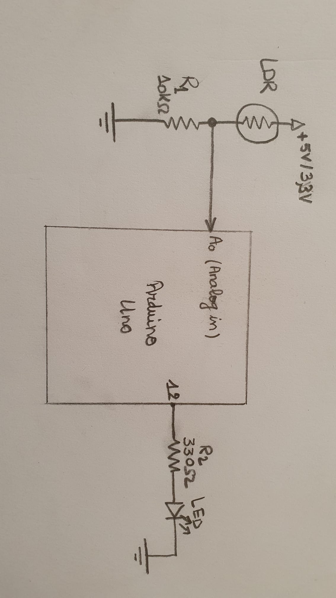

# Tech-Lduino
Simple LDR Circuit using arduino.
In this version ldr data is read via adc. raw and percent data are sent through serial line to display. 
2 circuits are tested:
 the first one with a simple led:

the second one with a relay

 
 here is the BOM could be found on amazon or any other distributors
 
 1- 1 x arduino uno 
 https://www.amazon.fr/Elegoo-ATmega328P-ATMEGA16U2-Controller-Microcontr%C3%B4leur/dp/B01N91PVIS/ref=sr_1_1_sspa?__mk_fr_FR=%C3%85M%C3%85%C5%BD%C3%95%C3%91&crid=38LGV415HPLAV&keywords=arduino+uno&qid=1648829669&sprefix=arduino+uno%2Caps%2C83&sr=8-1-spons&psc=1&spLa=ZW5jcnlwdGVkUXVhbGlmaWVyPUFSNzVWNDNBWEdNTjkmZW5jcnlwdGVkSWQ9QTA0MDIwMjMyV1FFQjYxTU5XMUpMJmVuY3J5cHRlZEFkSWQ9QTA5OTY2NTczSzE1S1UwOVFXSlJDJndpZGdldE5hbWU9c3BfYXRmJmFjdGlvbj1jbGlja1JlZGlyZWN0JmRvTm90TG9nQ2xpY2s9dHJ1ZQ==
 
 2- 1 x resistor 10 kohms 
 https://www.amazon.fr/s?k=10k+resistor&sprefix=10k+Res%2Caps%2C75&ref=nb_sb_ss_ts-doa-p_1_7
 
 3- 1 x resistor of 330 ohms 
 https://www.amazon.fr/s?k=330+ohm+resistor&sprefix=330+ohm+%2Caps%2C70&ref=nb_sb_ss_ts-doa-p_1_8
 
 4- 1 x LDR https://www.amazon.fr/s?k=LDR&__mk_fr_FR=%C3%85M%C3%85%C5%BD%C3%95%C3%91&crid=XNB2OMKA6MP2&sprefix=ldr%2Caps%2C75&ref=nb_sb_noss
 
 5- 1 x red LED https://www.amazon.fr/Gasea-Assortiment-d%C3%89clairage-%C3%89lectroniques-Composants/dp/B07MKNH4WQ/ref=sr_1_5?crid=2A4U6C3P5818S&keywords=led+arduino&qid=1648829526&sprefix=led+ard%2Caps%2C122&sr=8-5
 
 6- a couple of jumper wires https://www.amazon.fr/Elegoo-Breadboard-Femelle-Longueur-Arduino/dp/B01JD5WCG2/ref=sr_1_5?__mk_fr_FR=%C3%85M%C3%85%C5%BD%C3%95%C3%91&crid=29ITWHBUQWXE4&keywords=arduino+jumper+wire&qid=1648829700&sprefix=arduino+jumper+wires%2Caps%2C73&sr=8-5
 
 7- a relay module  https://www.amazon.fr/LJYIYY-SModule-Optocoupleur-Puissance-Contr%C3%B4le/dp/B09L7JGWGQ/ref=sr_1_45?__mk_fr_FR=%C3%85M%C3%85%C5%BD%C3%95%C3%91&crid=3I6F6W6Q1AC24&keywords=relay%2Bmodule%2Barduino+opto&qid=1648829368&sprefix=relay%2Bmodule%2Barduino+opto%2Caps%2C64&sr=8-45
 
 8- a breadboard https://www.amazon.fr/s?k=breadboard&sprefix=bread%2Caps%2C81&ref=nb_sb_ss_ts-doa-p_1_5
 
 
